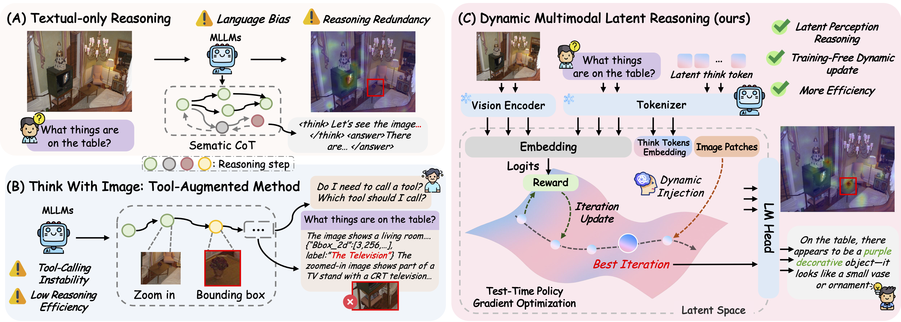

# Reasoning Within the Mind: Dynamic Multimodal Interleaving in Latent Space

This repository implements **DMLR** (Dynamic Multimodal Interleaving Latent Reasoning), a method for improving vision-language model reasoning through latent space optimization. The system uses reinforcement learning to optimize "thought tokens" that enhance the model's reasoning capabilities on multimodal tasks.



*Comparison between DMLR and two reasoning paradigms. (A) Text-only reasoning: relies solely on explicit CoT, often causing visual grounding errors and redundant steps. (B) Think-with-Image reasoning: depends on external perception tools, leading to unstable tool calls and extra overhead. (C) DMLR (ours): refines latent think tokens in the latent space through confidence-guided optimization and dynamically injects visual information, achieving self-improving reasoning without additional training while maintaining high efficiency.*

### Setup

1. Clone the repository:
```bash
git clone <repository-url>
cd DMLR
```

2. Install dependencies (using `uv` or `pip`):
```bash
# Using uv (recommended)
uv pip install -r requirements.txt

# Or using pip
pip install -r requirements.txt
```

3. Set up Hugging Face token (if needed for private models):
```bash
export HUGGING_FACE_TOKEN=your_token_here
```

4. Configure LLM verifier (for answer verification):
   Create a `.env` file in the project root with the following content:
```bash
OPENAI_API_KEY=your_api_key_here
OPENAI_API_BASE_URL=https://api.openai.com/v1
MODEL_TYPE=gpt-4.1-2025-04-14
```

## Quick Start

### Basic Usage

Run inference using the provided script:

```bash
bash script/run.sh
```

### Custom Configuration

You can modify `script/run.sh` or run directly with Python:

```bash
uv run python main.py \
    --dataset data/scienceqa.json \
    --model_name_or_path Qwen/Qwen2.5-VL-7B-Instruct \
    --output_dir ./output \
    --device cuda \
    --start_data_idx 0 \
    --end_data_idx 100 \
    --max_new_tokens 2048 \
    --max_num_steps 15 \
    --num_thought_tokens 2 \
    --sigma 25.0 \
    --lr 0.01
```

## Configuration

### Key Parameters

#### Dataset & Model
- `--dataset`: Path to dataset JSON file or dataset name
- `--model_name_or_path`: Hugging Face model identifier (default: `Qwen/Qwen2.5-VL-7B-Instruct`)
- `--output_dir`: Directory to save results
- `--start_data_idx`: Starting index for evaluation (default: 0)
- `--end_data_idx`: Ending index for evaluation (default: 100)

#### Optimization
- `--num_thought_tokens`: Number of thought tokens to optimize (default: 8)
- `--max_num_steps`: Maximum RL optimization steps (default: 20)
- `--lr`: Learning rate for optimization (default: 0.005)
- `--sigma`: Noise scale for exploration (default: 20.0)
- `--sigma_decay`: Decay factor for sigma (default: 0.95)
- `--reward_threshold`: Reward threshold to stop early (default: -1)

#### Visual Features
- `--num_selected_patches`: Max image patches per thought token
- `--initial_patch_count`: Initial number of patches to insert
- `--patch_increment`: Additional patches when best reward improves
- `--visual_insert_stride`: Insert visual tokens every N thought tokens
- `--visual_injection_start_step`: Start visual injection from this RL step
- `--visual_injection_interval`: Perform injection every N RL steps
- `--visual_only`: Use visual features to initialize thought tokens

#### Inference
- `--max_new_tokens`: Maximum tokens to generate (default: 2048)
- `--num_workers`: Number of worker processes (default: 1)
- `--worker_device_round_robin`: Distribute workers across GPUs
- `--min_pixels`: Minimum image pixels (default: 128)
- `--max_pixels`: Maximum image pixels (default: 256)

#### Verification
- `--use_llm_verify`: Use LLM to verify solution equivalence
- `--verify_only`: Re-verify existing results without re-running inference

## Datasets

The project supports multiple vision-language datasets. Place your dataset JSON files in the `data/` directory. Expected format:

```json
[
  {
    "prompt": "Question text",
    "solution": "Answer",
    "image_path": "path/to/image.jpg",
    "idx": 0
  }
]
```

## Output

Results are saved in the specified `output_dir`:

- `results.json`: Complete evaluation results with:
  - Model predictions
  - Ground truth answers
  - Correctness judgments
  - Best reward values and steps
  - Configuration parameters

### Results JSON Structure

```json
{
  "model": "Qwen/Qwen2.5-VL-7B-Instruct",
  "dataset": "data/scienceqa.json",
  "accuracy": 0.75,
  "correct": 75,
  "total": 100,
  "config": {...},
  "args": {...},
  "entries": [
    {
      "data_idx": 0,
      "question": "...",
      "model_output": "...",
      "answer": "...",
      "ground_truth": "...",
      "is_correct": true,
      "best_reward": 0.85,
      "best_reward_step": 5,
      "stop_reason": "eos_token"
    }
  ]
}
```

## Project Structure

```
DMLR/
├── main.py                 # Main entry point
├── DMLR/
│   ├── data.py            # Dataset loading
│   ├── inference.py       # Core inference logic
│   ├── reward.py          # Reward model implementation
│   ├── prompts.py         # Prompt templates
│   ├── verifier.py        # Answer verification
│   ├── utils.py           # Utility functions
│   └── logger.py          # Logging setup
├── data/                  # Dataset files
├── script/
│   └── run.sh            # Example run script
└── Readme.md             # This file
```

## Citation

If you use this code in your research, please cite:

```bibtex
@article{dmlr2025,
  title={Reasoning Within the Mind: Dynamic Multimodal Interleaving in Latent Space},
  author={Chengzhi Liu and Yuzhe Yang and Yue Fan and Qingyu Wei and Sheng Liu and Xin Eric Wang},
  year={2025}
}
```